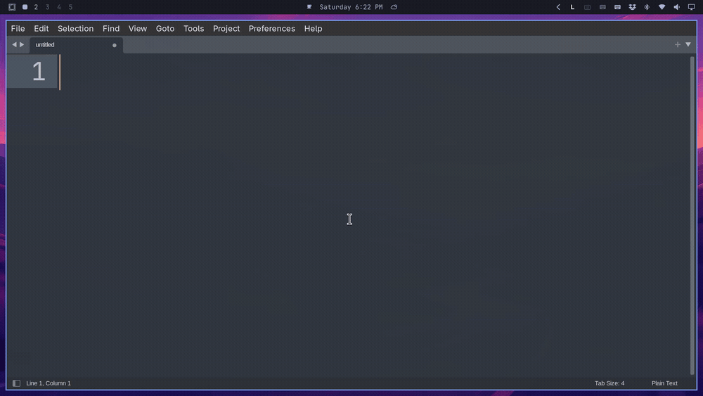
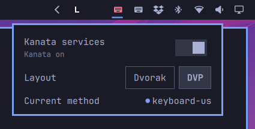

# Kanata Dvorak/QWERTY for Omarchy





An Omarchy bar widget that installs and toggles the two systemd **user** units
behind the Dvorak + QWERTY overlay setup:

- `kanata.service` — the kanata keyboard remapper
- `kanata-layer-watcher.service` — the fcitx5-driven layout layer switcher

Clicking the bar glyph opens a small popup with one on/off switch that starts
both units when off, or stops both when on; the switch and the bar icon reflect
live status. A **Layout** row picks **DVP** (Programmer Dvorak) or **Dvorak**
(plain Dvorak).

If the units are not installed yet, the popup shows a **Set up** button. It
writes the user files, starts the units, and opens a terminal for the one step
that needs root. It talks to `systemctl --user`, so no privilege escalation is
required for the toggle.

## What it does

| Scenario | Behaviour |
|----------|-----------|
| Normal English typing | **Dvorak** (`DVP` or plain, from the Layout row) |
| Hold **Shift** | A **real Shift** modifier + Dvorak shifted characters (so Shift+Super+Enter etc. work) |
| Hold **Ctrl** / **Super** / **Alt** | Raw **physical QWERTY** (so Ctrl+C/V/Z, Super+D, Alt+Tab work) |
| Any **non-English** IM active | **Physical QWERTY** (those tables are built for QWERTY positions, not Dvorak) |
| English ↔ other IM switch | Automatic (the watcher follows fcitx5's active input method) |

## How it works

- **kanata** (`/usr/bin/kanata_cmd_allowed`) remaps every key at the **evdev**
  layer. It is the *only* component that applies Dvorak — nothing else does.
- **layouts** — two configs ship, `dvp-qwerty.kbd` (Programmer Dvorak) and
  `dvorak-qwerty.kbd` (plain Dvorak). `~/.config/kanata/active.kbd` is a symlink
  to the chosen one, and `kanata.service` reads it. The Layout row repoints the
  symlink and restarts the unit.
- **kanata layers**:
  - `base` / `shift` — Dvorak (unshifted / shifted). Shift is held as
    a **real** modifier and the `shift` layer emits the *unshifted* US keys that
    the real Shift turns into the Dvorak shifted characters (`unshift` forces the
    literal digits/backtick through). This keeps Shift visible to the OS for
    chords like Shift+Super+Enter or Ctrl+Shift+arrows.
  - `ctrl` / `qwerty` — physical QWERTY pass-through, activated while holding
    Ctrl / Super / Alt (via `multi <mod> (layer-while-held <layer>)`, which
    keeps the real modifier pressed *and* switches the layer).
  - `qwerty` also stands in for every other input method: unless the active IM is
    exactly English US, kanata passes physical QWERTY through.
- **watcher** (`kanata-layer-watcher.sh`) polls `fcitx5-remote -n` every 0.05 s
  and tells kanata which layer to use over kanata's TCP IPC (port 17000),
  using newline-delimited JSON: `{"ChangeLayer":{"new":"<layer>"}}`.
- **fcitx5** applies **no** Dvorak layout. Its English IM is a *plain US*
  `keyboard-us`, so kanata's Dvorak output passes straight through. (A
  `keyboard-us-dvp` fcitx5 IM would double-apply Dvorak and produce garbage — do
  **not** use it.) The fcitx5 profile itself is not part of this plugin; see
  [Configuration](#configuration).

## What ships in this plugin

```
resources/
  dvp-qwerty.kbd                  Programmer Dvorak + QWERTY layers
  dvorak-qwerty.kbd               plain Dvorak + QWERTY layers
  kanata-layer-watcher.sh         follows fcitx5's active input method
  systemd/kanata.service          starts kanata (TCP port 17000)
  systemd/kanata-layer-watcher.service
  install.sh                      the setup script
```

`install.sh` links both `.kbd` files and the watcher into
`~/.config/kanata/`, points `active.kbd` at `dvp-qwerty.kbd` when it does not
exist yet, writes the two units into `~/.config/systemd/user/`, and
enables them. One root step installs the `kanata-bin` package, adds the user to
the `input` and `uinput` groups, and writes the udev rule for `/dev/uinput`.

## Requirements

- **Arch-based** distro (Omarchy/EndeavourOS/etc.) with `pacman` and an AUR
  helper (`yay` or `paru`).
- `kanata-bin` (AUR) — provides `/usr/bin/kanata_cmd_allowed`. The plain
  `kanata` binary is compiled **without** the `cmd` feature, which the watcher
  relies on; the plugin installs the `cmd_allowed` binary.
- `fcitx5` + `fcitx5-table-extra` (for the Chinese tables, such as Cangjie).
- A **Wayland** compositor (Hyprland) and the systemd **user** manager.
- Your user must be in the `input` and `uinput` groups (for `/dev/input` and
  `/dev/uinput`). The plugin installs the udev rule and the group membership.

## Install

```bash
omarchy plugin add https://github.com/godkin/omarchy-plugin-omarchy-dvp-qwerty-toggle.git --enable
```

Or, from a local checkout:

```bash
omarchy plugin add . --enable
```

Then place it in the bar if it did not land automatically:

```bash
omarchy bar move godkin.omarchy-dvp-qwerty-toggle --section right
```

Open the popup and press **Set up** if Kanata is not set up yet. Log out and
back in once, so the `input` and `uinput` group change reaches the keyboard, and
start a graphical session (Hyprland).

Run `resources/install.sh` on its own when you prefer the terminal:

```bash
./resources/install.sh               # user step, then the root step through sudo
./resources/install.sh --user-only   # only the files under ~/.config
./resources/install.sh --root-only   # only packages, groups and the udev rule
```

The fcitx5 input method profile is not part of this plugin. Configure fcitx5
with a `keyboard-us` input method and any Chinese input methods you use, then the
watcher switches kanata between Dvorak for English US and QWERTY passthrough for
every other input method as you change it. Only the exact `keyboard-us` name gets
Dvorak; every other IM name gets QWERTY.

## Configuration

Add a plain US `keyboard-us` input method to fcitx5 for English, plus any others
(Cangjie, Quick, and so on). Because fcitx5 applies no Dvorak layout, kanata's
output passes through unchanged. Only a fcitx5 IM whose name is exactly
`keyboard-us` selects Dvorak; every other name selects physical QWERTY.

| Input method | kanata layer |
|--------------|--------------|
| `keyboard-us` | Dvorak (`DVP` or plain) |
| anything else (Cangjie, Quick, ...) | physical QWERTY (the original layout) |

## Usage

After logging into Hyprland, the services start automatically with the
graphical session. Switch input methods with your fcitx5 hotkey (usually
`Super+Space` or `Ctrl+Space`):

- **`keyboard-us`** → Dvorak (`DVP` or plain)
- **any other IM** (not `keyboard-us`) → physical QWERTY, the original layout

Keyboard shortcuts behave normally at all times because holding Ctrl / Super /
Alt switches to QWERTY for the duration of the press.

| Action | Result |
|--------|--------|
| Left click | Open the popup with the on/off switch |
| Switch | Stop both units if both are active, otherwise start both |
| Layout | Pick `DVP` (Programmer Dvorak) or `Dvorak` (plain); repoints `active.kbd` and restarts kanata |
| Hover | Tooltip shows `Kanata on` / `Kanata off` / `Kanata partial` / `Kanata: switching…` |
| IPC | `omarchy-shell kanata-service toggle` toggles from anywhere |
| IPC | `omarchy-shell kanata-service togglePanel` opens the popup |
| IPC | `omarchy-shell kanata-service layout dvorak-qwerty` picks a layout from anywhere |

The widget can also be driven over IPC, so a keybinding can reuse it:

```lua
-- ~/.config/hypr/bindings.lua
o.bind("SUPER", "K", "omarchy-shell kanata-service toggle", "Toggle Kanata")
```

## Settings

Set these inline on the widget's entry in `~/.config/omarchy/shell.json`:

| Key | Default | Description |
|-----|---------|-------------|
| `refreshIntervalSec` | `5` | How often to poll unit status |
| `kanataUnit` | `kanata.service` | Main kanata unit |
| `watcherUnit` | `kanata-layer-watcher.service` | Layer watcher unit |

## Troubleshooting

```bash
# status
systemctl --user status kanata.service kanata-layer-watcher.service

# watch the auto-switcher log
journalctl --user -u kanata-layer-watcher.service -f

# see which kanata layer is active right now
timeout 2 bash -c 'exec 3<>/dev/tcp/127.0.0.1/17000 && cat <&3'

# restart after editing the config
systemctl --user restart kanata.service

# validate the kanata config without running it
kanata_cmd_allowed -c ~/.config/kanata/active.kbd --port 0
```

The kanata config lives in this plugin. Edit `resources/dvp-qwerty.kbd` or
`resources/dvorak-qwerty.kbd`, then run `resources/install.sh --user-only`, or
edit the linked file under `~/.config/kanata/` directly.

### Common issues

- **Output is garbage / double-Dvorak** (`qwerty` → `_WVLFU`):
  fcitx5 is applying a Dvorak layout on top of kanata. Make sure the fcitx5
  English IM is plain `keyboard-us` (US layout), **not** `keyboard-us-dvp`.
- **kanata won't start — `status=216/GROUP`**:
  do **not** set `SupplementaryGroups=` in the unit; the systemd user manager
  cannot call `setgroups`. Rely on normal group membership instead (see the
  `input` group step).
- **Top-row letters come out uppercase**:
  in DVP the physical `r t y u i o p` keys type lowercase `p y f g c r l`
  normally and uppercase only with Shift. The bundled `dvp-qwerty.kbd` already
  encodes this correctly.
- **No Chinese IM in fcitx5**: install `fcitx5-table-extra` and reload fcitx5
  (`fcitx5-remote -r`).
- **A key repeats after you toggle Kanata on**:
  kanata used to hold the keyboard for two seconds before it was ready, so a key
  pressed in that window lost its release by the time kanata started. The unit
  runs kanata with `--nodelay` to remove that window.

## Layer reference (Programmer Dvorak)

Physical QWERTY key → DVP output (`resources/dvp-qwerty.kbd`, `base` layer):

```
grv:$   1:&  2:[  3:{  4:}  5:(  6:=  7:*  8:)  9:+  0:]  -:!  =:#
q:;  w:,  e:.  r:p  t:y  y:f  u:g  i:c  o:r  p:l  [:/  ]:@  \:\
a:a  s:o  d:e  f:u  g:i  h:d  j:h  k:t  l:n  ;:s  ':-  ret:ret
z:'  x:q  c:j  v:k  b:x  n:b  m:m  ,:w  .:v  /:z
```

The `shift` layer mirrors these with Shift applied (letters become uppercase;
number row becomes `~ % 7 5 3 1 9 0 2 4 6 8 \``). Internally it emits the
*unshifted* US keys while a real Shift is held, so the OS sees both the DVP
character and a genuine Shift modifier (needed for Chord+Shift shortcuts).

## Layer reference (Dvorak)

Physical QWERTY key → plain Dvorak output (`resources/dvorak-qwerty.kbd`, `base`
layer):

```
grv:`   1:1  2:2  3:3  4:4  5:5  6:6  7:7  8:8  9:9  0:0  -:[  =:]
q:'  w:,  e:.  r:p  t:y  y:f  u:g  i:c  o:r  p:l  [:/  ]:=  \:\
a:a  s:o  d:e  f:u  g:i  h:d  j:h  k:t  l:n  ;:s  ':-  ret:ret
z:;  x:q  c:j  v:k  b:x  n:b  m:m  ,:w  .:v  /:z
```

## Remove

```bash
omarchy plugin remove godkin.omarchy-dvp-qwerty-toggle
```

This removes the widget only. Stop and remove the units yourself when you no
longer want them:

```bash
systemctl --user disable --now kanata.service kanata-layer-watcher.service
rm ~/.config/systemd/user/kanata.service ~/.config/systemd/user/kanata-layer-watcher.service
```

## License

MIT
